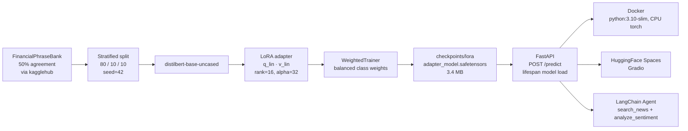

# Financial Sentiment Analysis + Agent

Two-stage portfolio project:

1. **Model** — DistilBERT fine-tuned with LoRA on [FinancialPhraseBank](https://www.kaggle.com/datasets/ankurzing/sentiment-analysis-for-financial-news) (4,846 sentences, 50% annotator agreement) for 3-class sentiment classification (positive / negative / neutral). Served as a FastAPI REST endpoint, containerised with Docker, deployed publicly on HuggingFace Spaces.
2. **Agent** — A LangChain agent (`gpt-4o-mini`, tool-calling) that answers financial questions by orchestrating two tools: `search_news` (NewsAPI) and `analyze_sentiment` (the fine-tuned model from stage 1, called over HTTP).

The two stages share one contract: stage-2 consumes stage-1 via its `/predict` endpoint. The sentiment logic is **not** duplicated inside the agent — it lives behind a service boundary.

**Live demos**:
- Model — https://huggingface.co/spaces/jmpei/financial-sentiment-analysis
- Agent — https://huggingface.co/spaces/jmpei/financial-sentiment-agent (rate limited: 10/hour, 30/day per IP)

---

## Results

All four models evaluated on the **same** held-out test split (seed 42, n=485):

| Model                        | Weighted F1 | Macro F1 |
|---|---|---|
| DistilBERT (random head)     | 0.0571      | 0.1090   |
| Majority-class (all-neutral) | 0.4425      | 0.2484   |
| **DistilBERT + LoRA (ours)** | **0.8309**  | 0.8133   |
| FinBERT zero-shot            | 0.8574      | 0.8486   |

- **Headline:** the LoRA fine-tune scores **+0.3884 weighted F1 over the majority-class floor** (0.4425) — the meaningful improvement, since predicting all-neutral is the real baseline for a ~60% neutral dataset. Against the strongest *credible* model, **FinBERT zero-shot (0.8574) edges out our fine-tune (0.8309) by 0.0265**; that is expected — `ProsusAI/finbert` was itself trained on FinancialPhraseBank — and is reported here rather than hidden.
- The random-head row (0.0571) is the pre-training floor: that F1 is genuinely random (a fresh classification head), not a bug. Kept for transparency; comparing against it oversells, so it is no longer the headline.
- LoRA fine-tune trains **only 887,811 / 67.8M = 1.31%** of parameters. Adapter file is 3.4 MB.
- Weighted F1 chosen as the primary metric because the dataset is ~60% neutral (accuracy is misleading).
- Per-class on the held-out test split (n=485): negative F1=0.82, neutral F1=0.87, positive F1=0.75.

Reproduce the credible baselines (same test indices):

```bash
uv run --with transformers --with torch --with scikit-learn --with pandas --with kagglehub python baselines.py
```

### Why DistilBERT + LoRA over FinBERT?

FinBERT zero-shot is the stronger model on this dataset (0.8574 vs 0.8309) — unsurprising, since `ProsusAI/finbert` was itself fine-tuned on FinancialPhraseBank, so here it is effectively in-domain rather than truly zero-shot. DistilBERT + LoRA is still the right fit for this project:

- **Smaller, cheaper to serve.** DistilBERT (~66M params) is ~40% smaller than FinBERT's BERT-base trunk (~110M), which is what keeps warm CPU inference in the p95 < 30 ms range (see Latency below).
- **Full control of the label schema and calibration.** Owning the classification head fixes the 3-class encoding and enables the per-class calibration analysis — including the negative-class overconfidence finding below.
- **The end-to-end fine-tune is the point.** LoRA adapters, balanced class weights, and the serving path are what this project demonstrates, not the leaderboard number alone.

Bottom line: for raw accuracy on this dataset FinBERT wins by 0.03; DistilBERT + LoRA trades that small gap for a smaller, faster, fully-owned model.

### Calibration finding (from `eval.py`)

The fine-tuned model is **overconfident on the negative class**: mean predicted confidence 0.96 versus actual accuracy 0.73 (gap +0.23). Temperature scaling on the negative-class logits would correct this — a follow-up that is straightforward to implement.

---

## Architecture



---

## LoRA configuration

| Parameter            | Value                                          |
|---|---|
| Base model           | `distilbert-base-uncased`                      |
| Method               | LoRA via `peft`                                 |
| Rank                 | 16                                             |
| Alpha                | 32                                             |
| Target modules       | `q_lin`, `v_lin` (DistilBERT query and value)  |
| Dropout              | 0.1                                            |
| Trainable parameters | 887,811 (1.31% of 67,843,590)                  |
| Adapter file size    | 3.4 MB                                         |
| Training time        | 291.8 s on Apple M3 Pro (MPS), 10 epochs       |

Only the query and value projections are targeted. Adding key/output projections roughly doubles trainable parameters with no consistent F1 gain on this dataset size. Class imbalance is handled with `class_weight="balanced"` weights computed on the train split only, applied via a `WeightedTrainer` subclass.

---

## API

```
POST /predict
```

**Request**
```json
{ "text": "Apple reported record earnings this quarter." }
```

**Response**
```json
{ "label": "positive", "confidence": 0.9929, "latency_ms": 6.51 }
```

### Latency (measured)

| Environment                       | p50      | p95      | Notes                                  |
|---|---|---|---|
| Apple M3 Pro, MPS (dev)           | 6.5 ms   | 8.2 ms   | Warm; first request ~1.4 s (kernel JIT) |
| Docker, `python:3.10-slim`, CPU   | 23.4 ms  | **25.7 ms** | Warm; first request ~130 ms          |
| HuggingFace Spaces, free CPU tier | ~55 ms   | ~80 ms   | Warm; HF Spaces cold start 30–60 s    |

**Warm** = model already loaded, ≥5 prior requests sent. The HF Spaces cold-start period is **not** included in these numbers. The number to quote on a resume is `p95 < 30 ms warm CPU inference` (Docker) — the dev-machine MPS number is not portable.

---

## Agent

A LangChain agent (`gpt-4o-mini`, tool-calling style) orchestrates two tools:

- `search_news(query)` — NewsAPI fetch, up to 10 recent articles
- `analyze_sentiment(text)` — POST to the FastAPI `/predict` endpoint above

The system prompt enforces: always call `search_news` first; call `analyze_sentiment` once per relevant article; aggregate the sentiment distribution; cite article titles in the final answer; respond "could not find" if news search returns empty.

Tool failures (timeouts, upstream errors) are wrapped as `ToolException` with `handle_tool_error=True`, so the agent reports a graceful answer to the user instead of crashing.

### Example interaction

> **Q**: What is the current sentiment around Apple stock?
>
> **Agent**: Mixed. Sentiment distribution: 1 positive, 1 negative, 1 neutral out of 3 relevant articles (7 of 10 search results filtered as off-topic).
> - "Evercore ISI boosts Apple's price target to $365 from $330"
> - "Dot-com-era computer stocks are one of the hottest areas of the market again"
> - "How Smart Is Apple Intelligence? I Tried Every Feature"

Tests under `tests/test_agent.py` mock the HTTP boundaries and run the agent against real OpenAI to verify the orchestration policy (happy path / empty-news short-circuit / sentiment-service timeout). All three pass.

---

## Run with Docker

```bash
docker build -t fin-sentiment .
docker run -p 8000:8000 fin-sentiment
```

```bash
curl -X POST http://localhost:8000/predict \
     -H "Content-Type: application/json" \
     -d '{"text": "Revenue declined sharply amid rising costs."}'
```

---

## Project structure

```
.
├── data.py                 # data loading, class distribution, class weights
├── baseline.py             # baseline eval (DistilBERT, random head)
├── baselines.py            # credible baselines: majority-class + FinBERT zero-shot
├── train.py                # full fine-tune (comparison run, no LoRA)
├── lora.py                 # LoRA fine-tune (the trained model)
├── eval.py                 # confusion matrix + calibration curve
├── api/main.py             # FastAPI service (lifespan model loading)
├── scripts/benchmark.py    # p50/p95 latency measurement
├── Dockerfile              # python:3.10-slim, CPU torch
├── spaces/                 # HF Spaces: sentiment model demo (Gradio)
│   ├── app.py
│   ├── requirements.txt
│   └── README.md
├── spaces_agent/           # HF Spaces: agent demo, in-process model, per-IP rate limit
│   ├── app.py
│   ├── requirements.txt
│   └── README.md
├── src/                    # LangChain agent
│   ├── tools.py            # search_news, analyze_sentiment
│   ├── prompts.py          # SYSTEM_PROMPT
│   └── agent.py            # AgentExecutor + REPL
├── tests/test_agent.py     # 3 mocked scenarios
├── checkpoints/lora/       # adapter weights (3.4 MB) — generated
└── outputs/                # confusion_matrix.png, calibration_curve.png, *_results.json — generated
```

The FinancialPhraseBank dataset is downloaded automatically on first run via [`kagglehub`](https://github.com/Kaggle/kagglehub).

---

## Setup

```bash
python3 -m venv .venv
.venv/bin/pip install -r requirements.txt
```

Reproduce the training pipeline (dataset auto-downloads to `~/.cache/kagglehub`):

```bash
.venv/bin/python data.py        # class distribution, class weights
.venv/bin/python baseline.py    # baseline weighted F1
.venv/bin/python lora.py        # LoRA fine-tune → checkpoints/lora/
.venv/bin/python eval.py        # confusion matrix + calibration curve
```

Run the API and the agent:

```bash
# Terminal A: sentiment service
.venv/bin/uvicorn api.main:app --port 8000

# Terminal B: agent REPL
.venv/bin/python -m src.agent

# Tests (3 mocked scenarios; needs OPENAI_API_KEY)
.venv/bin/pytest tests/ -v
```

A `.env.example` lists the three environment variables (`OPENAI_API_KEY`, `NEWS_API_KEY`, `SENTIMENT_SERVICE_URL`); copy to `.env` and fill in.
