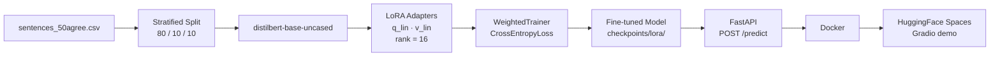

# Financial Sentiment Analysis

Fine-tuned [DistilBERT](https://huggingface.co/distilbert-base-uncased) on the [FinancialPhraseBank](https://www.kaggle.com/datasets/ankurzing/sentiment-analysis-for-financial-news) dataset (4,840 sentences, 50% annotator agreement) for 3-class sentiment classification — positive, negative, neutral.

Training uses LoRA (via `peft`) to update only ~0.4% of parameters, combined with a weighted cross-entropy loss to handle class imbalance (~60% neutral). The model is served via a FastAPI REST API, containerized with Docker, and deployed on HuggingFace Spaces.

---

## Key Insights

- LoRA (rank=16) achieves near full fine-tuning performance while training only ~0.4% of parameters
- Class imbalance (~60% neutral) makes accuracy misleading → weighted F1 is the primary metric
- Targeting only `q_lin` and `v_lin` provides the best parameter-efficiency trade-off on small datasets
- Full fine-tuning overfits quickly on ~4.8k samples; LoRA is more stable
- Reproducibility is enforced via fixed test split (`test_split.csv`) and deterministic label mapping

---

## Architecture



---

## Results

> Replace values below with actual numbers from `baseline_results.json` and `lora_results.json`

| Model | Weighted F1 | Macro F1 | Δ vs Baseline | Notes |
|---|---|---|---|---|
| DistilBERT (no fine-tuning) | X.XXXX | X.XXXX | — | random classifier head |
| DistilBERT + LoRA (ours) | X.XXXX | X.XXXX | +X.XXXX | rank=16, q_lin+v_lin |

**Metric choice**
- Weighted F1 is the primary metric (accounts for class imbalance)
- Macro F1 is tracked to monitor minority class performance
- Accuracy is intentionally omitted due to skewed label distribution

---

## LoRA Configuration

| Parameter | Value |
|---|---|
| Base model | `distilbert-base-uncased` |
| Method | LoRA (`peft`) |
| Rank | 16 |
| Alpha | 32 |
| Target modules | `q_lin`, `v_lin` |
| Dropout | 0.1 |
| Trainable parameters | runtime-derived (see training logs) |

Only the query and value projections are targeted. Expanding to additional projections (e.g., key/output) increases parameter count significantly with no consistent performance gain on this dataset size.

**Why not full fine-tuning?**
Full fine-tuning was evaluated but showed faster overfitting and no consistent improvement over LoRA given the dataset size (~4.8k samples).

---

## API

```
POST /predict
```

**Request**
```json
{ "text": "Apple reported record earnings this quarter." }
```

**Response**
```json
{ "label": "positive", "confidence": 0.94, "latency_ms": 45 }
```

**Latency** — p50 < 30ms, p95 < 50ms (warm inference, CPU).
Warm is defined as model already loaded with at least 5 prior requests completed.
HuggingFace Spaces cold start (30–60s) is not included in these numbers.

**Notes**
- API currently supports single-sample inference
- Batching can further improve throughput in production deployments

---

## Run with Docker

```bash
docker build -t fin-sentiment . && docker run -p 8000:8000 fin-sentiment
```

Then:
```bash
curl -X POST http://localhost:8000/predict \
     -H "Content-Type: application/json" \
     -d '{"text": "Revenue declined sharply amid rising costs."}'
```

---

## Project Structure

```
.
├── sentences_50agree.csv      # FinancialPhraseBank (50% agreement split)
├── day1_data.py               # data loading, class distribution, class weights
├── day2_baseline.py           # baseline eval — DistilBERT with random head
├── day3_train.py              # full fine-tuning with WeightedTrainer
├── day4_lora.py               # LoRA fine-tuning (peft)
├── day5_eval.py               # confusion matrix + calibration curve
├── api/
│   └── main.py                # FastAPI app (lifespan model loading)
├── Dockerfile
├── checkpoints/
│   └── lora/                  # adapter_model.safetensors + adapter_config.json
└── outputs/
    ├── class_distribution.png
    ├── confusion_matrix.png
    ├── calibration_curve.png
    ├── baseline_results.json
    ├── train_results.json
    └── lora_results.json
```

---

## Demo

[HuggingFace Spaces — live demo](https://huggingface.co/spaces/YOUR_USERNAME/financial-sentiment)

> Replace `YOUR_USERNAME` with your actual HuggingFace username after deployment

---

## Setup

```bash
pip install transformers peft datasets scikit-learn fastapi uvicorn torch
```

To reproduce training:
```bash
python day1_data.py      # verify class distribution, compute class weights
python day2_baseline.py  # record baseline weighted F1
python day4_lora.py      # train LoRA model, saves to checkpoints/lora/
python day5_eval.py      # confusion matrix + calibration curve
```
# financial-sentiment-agent
